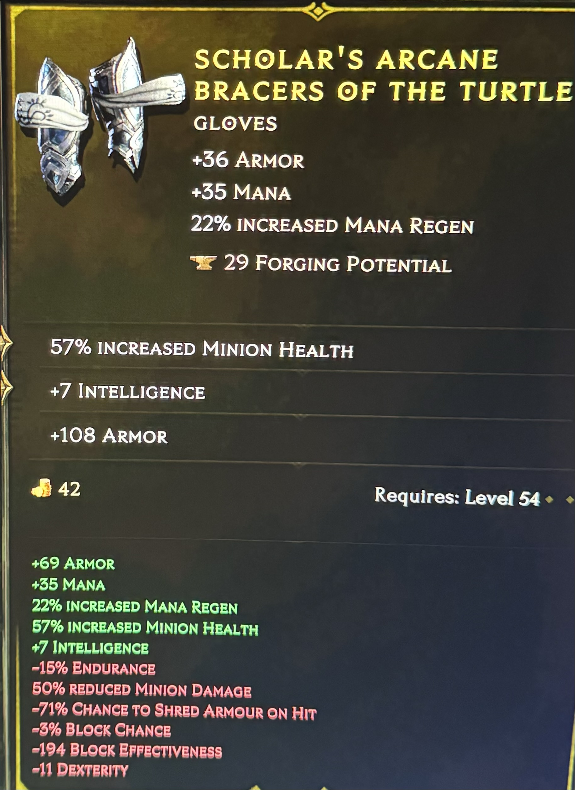
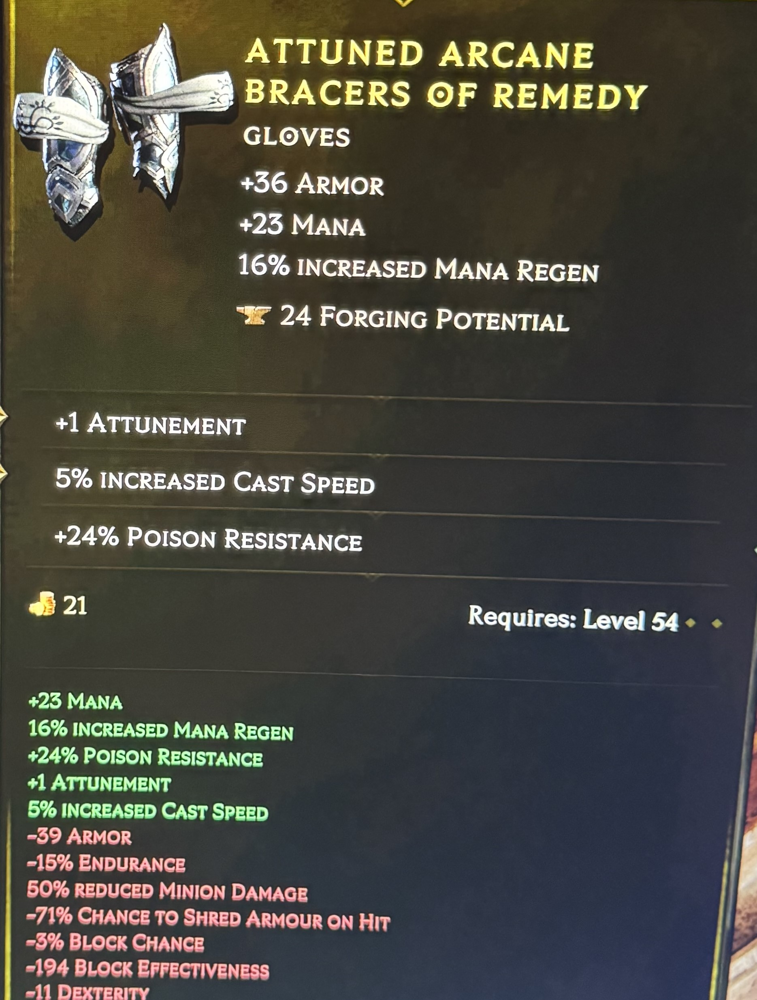

Apologies for the phone images. I needed both of my monitors but still wanted to reference the items. I didn't realize I would be uploading them at the time.

3b9727722400000002040a830046ead61d0320461041f655401fee00ddd2573a784809f64468e5a99d497c96

| Hex | Int | Purpose           | Notes/Affix                             | Tier   | Value | Range       |
|-----|-----|-------------------|-----------------------------------------|--------|-------|-------------|
| 3B  | 59  |                   |                                         |        |       |             |
| 97  | 151 |                   |                                         |        |       |             |
| 27  | 39  |                   |                                         |        |       |             |
| 72  | 114 |                   |                                         |        |       |             |
| 24  | 36  |                   |                                         |        |       |             |
| 0   | 0   |                   |                                         |        |       |             |
| 0   | 0   |                   |                                         |        |       |             |
| 0   | 0   |                   |                                         |        |       |             |
| 2   | 2   | Rarity            | Unverified                              |        |       |             |
| 4   | 4   | BaseType ID       | Gloves                                  |        |       |             |
| 0A  | 10  | SubType ID        | Arcane Bracers                          |        |       |             |
| 83  | 131 |                   |                                         |        |       |             |
| 0   | 0   |                   |                                         |        |       |             |
| 46  | 70  |                   |                                         |        |       |             |
| EA  | 234 |                   |                                         |        |       |             |
| D6  | 214 |                   |                                         |        |       |             |
| 1D  | 29  | Forging Potential |                                         |        |       |             |
| 3   | 3   |                   |                                         |        |       |             |
| 20  | 32  |                   |                                         |        |       |             |
| 46  | 70  | Affix             | Increased Minion Health                 | Tier 3 | 57%   | 56% to 75%  |
| 10  | 16  |                   |                                         |        |       |             |
| 41  | 65  |                   |                                         |        |       |             |
| F6  | 246 | Affix             | Added Intelligence                      | Tier 5 | 7     | 7 to 10     |
| 55  | 85  |                   |                                         |        |       |             |
| 40  | 64  |                   |                                         |        |       |             |
| 1F  | 31  | Affix             | Armor                                   | Tier 5 | 108   | 81 to 110   |
| EE  | 238 |                   |                                         |        |       |             |
| 0   | 0   |                   |                                         |        |       |             |
| DD  | 221 |                   | A lot of items seem to only go this far |        |       |             |
| D2  | 210 |                   |                                         |        |       |             |
| 57  | 87  |                   |                                         |        |       |             |
| 3A  | 58  |                   |                                         |        |       |             |
| 78  | 120 |                   |                                         |        |       |             |
| 48  | 72  |                   |                                         |        |       |             |
| 9   | 9   |                   |                                         |        |       |             |
| F6  | 246 |                   |                                         |        |       |             |
| 44  | 68  |                   |                                         |        |       |             |
| 68  | 104 |                   |                                         |        |       |             |
| E5  | 229 |                   |                                         |        |       |             |
| A9  | 169 |                   |                                         |        |       |             |
| 9D  | 157 |                   |                                         |        |       |             |
| 49  | 73  |                   |                                         |        |       |             |
| 7C  | 124 |                   |                                         |        |       |             |
| 96  | 150 |

3b9725421400000002040a03005e344d180330135101f8c20004cd00

| Hex | Int | Purpose           | Notes/Affix       | Tier   | Value | Range      |
|-----|-----|-------------------|-------------------|--------|-------|------------|
| 3B  | 59  |                   |                   |        |       |            |
| 97  | 151 |                   |                   |        |       |            |
| 25  | 37  |                   |                   |        |       |            |
| 42  | 66  |                   |                   |        |       |            |
| 14  | 20  |                   |                   |        |       |            |
| 0   | 0   |                   |                   |        |       |            |
| 0   | 0   |                   |                   |        |       |            |
| 0   | 0   |                   |                   |        |       |            |
| 2   | 2   | Rarity            | Unverified        |        |       |            |
| 4   | 4   | BaseType ID       | Gloves            |        |       |            |
| 0A  | 10  | SubType ID        | Arcane Bracers    |        |       |            |
| 3   | 3   | Affix Count       | Unverified        |        |       |            |
| 0   | 0   |                   |                   |        |       |            |
| 5E  | 94  |                   |                   |        |       |            |
| 34  | 52  |                   |                   |        |       |            |
| 4D  | 77  |                   |                   |        |       |            |
| 18  | 24  | Forging Potential |                   |        |       |            |
| 3   | 3   |                   |                   |        |       |            |
| 30  | 48  |                   |                   |        |       |            |
| 13  | 19  | Affix             | Poison Resistance | Tier 4 | 24%   | 22% to 29% |
| 51  | 81  |                   |                   |        |       |            |
| 1   | 1   |                   |                   |        |       |            |
| F8  | 248 | Affix             | Attunment         | Tier 1 | 1     | 1 to 1     |
| C2  | 194 |                   |                   |        |       |            |
| 0   | 0   |                   |                   |        |       |            |
| 4   | 4   | Affix             | Cast Speed        | Tier 1 | 5%    | 4% to 5%   |
| CD  | 205 |                   |                   |        |       |            |
| 0   | 0   |
